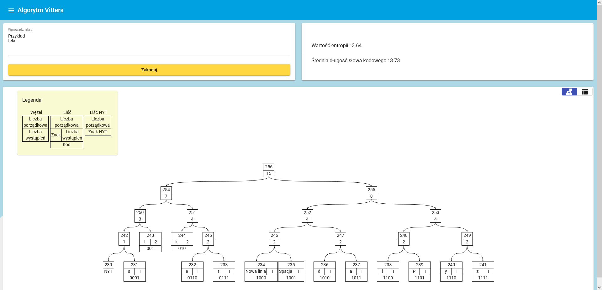
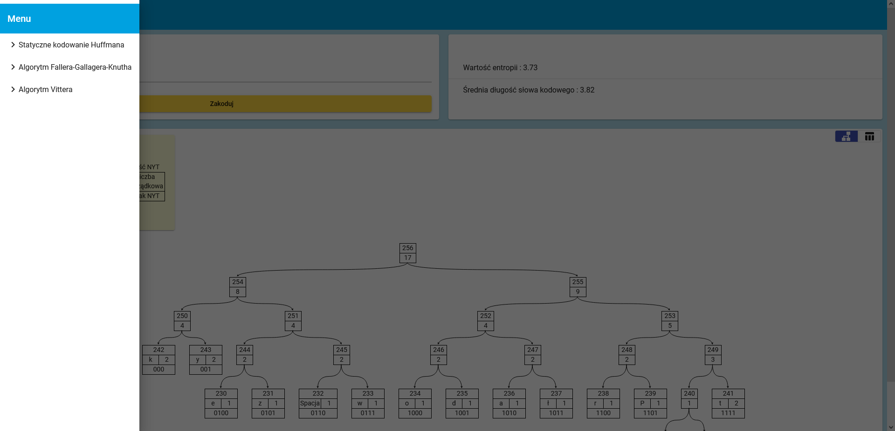
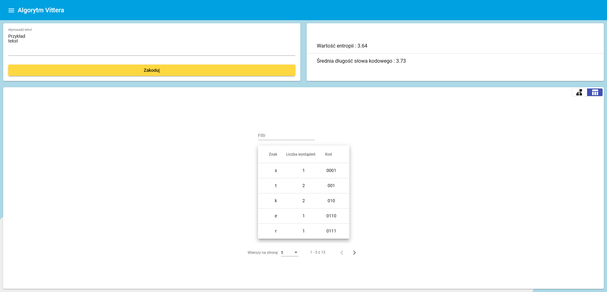

# Huffman Coding
### Website about Huffman coding algorithm.

The goal of the project is to create a web application that allows users to learn the principles of the Huffman coding algorithm.

The application also includes Faller-Gallager-Knuth and Vitter variants of this algorithm.

## Getting Started

These instructions will get you a copy of the project up and running on 
your local machine for development and testing purposes.

### Prerequisites

* Node.js [15.5.0 or above] - https://nodejs.org/
* npm [7.3.0 or above] - https://www.npmjs.com/

Detailed information about installation and configurations are provided at developers' site.

## Technology Stack

* Angular [9.1.0+]
* Angular Material
* TypeScript
* SCSS
* JavaScript
* Treant.js - https://fperucic.github.io/treant-js/

### Build 

A step by step instruction [on Windows 10]:
* Navigate to project directory in Command Prompt (cmd).
* Run `npm run start` to start application's local development server. 

  ```
  npm start
  ```
  
* Navigate to `http://localhost:4200/` in your browser. 
The application will automatically reload if you change any of the source files.

The continous integration process is managed by Travis CI.

The default provider for the production environment is set to Heroku.

In order to distribute the application in a cloud environment, ``.travis.yml`` file should be modified accordingly.

## Preview

<table>
    <tr>
        <td>
            <p>Huffman Tree</p>
            
        </td>
        <td>
            <p>Sidebar Menu</p>
            
        </td>
    </tr>
        <td>
            <p>Huffman Tree Node Table</p>
            
        </td>
    </tr>
</table>

## Author

* **Michał Koziara** 


